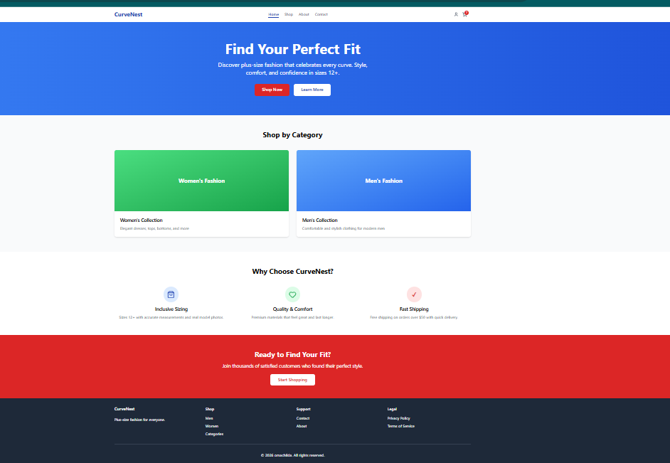
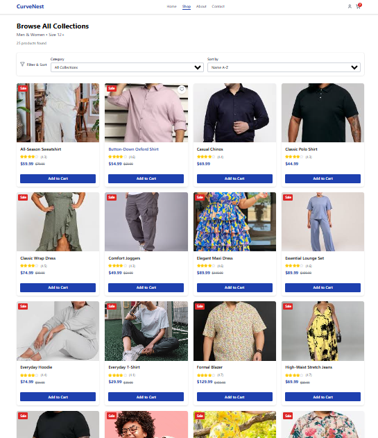
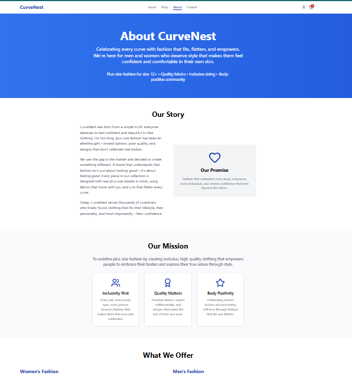
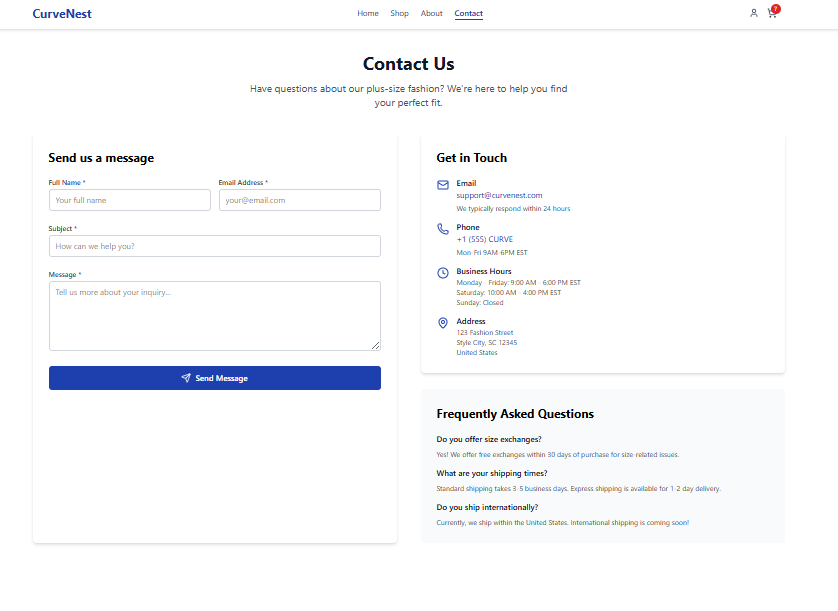
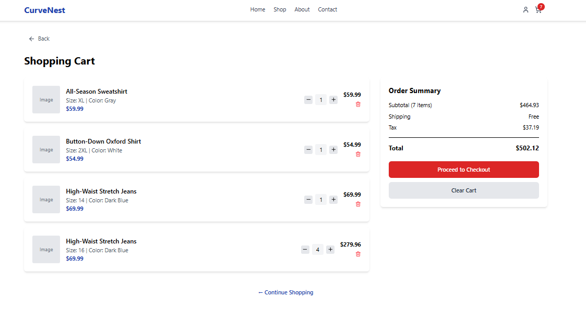
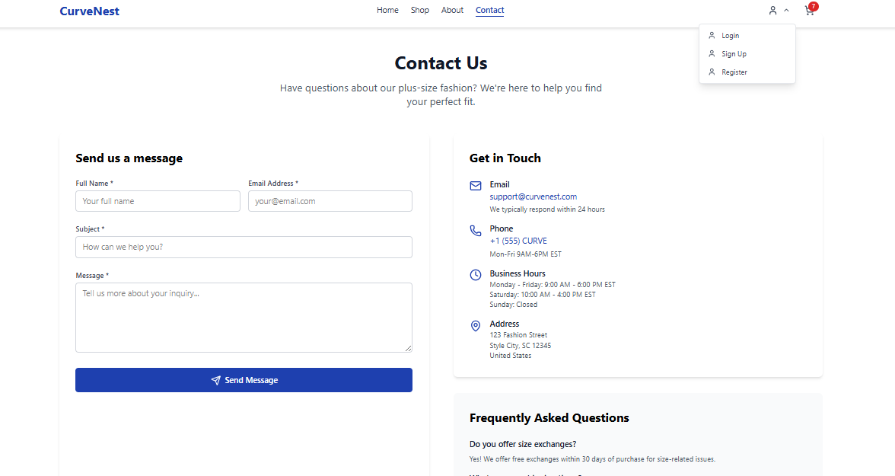
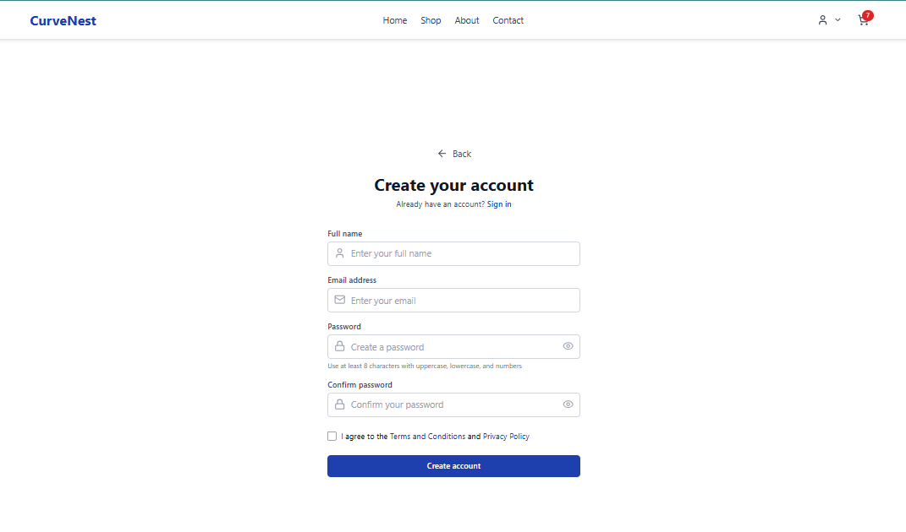

# 🛍️ CurveNest — Plus-Size Fashion E-commerce Platform

CurveNest is a modern, inclusive e-commerce platform dedicated to **plus-size fashion for men and women**.
Built with **React, TypeScript, Tailwind CSS**, and **Zustand**, the platform delivers a fast, accessible, and professional shopping experience.

---

## 📸 Screenshots

### Home Page



### Shop Page



### Product Details



### Shopping Cart



### Authentication



### About Page



### Contact Page



---

## 🌟 Features

### 🛒 Shopping Experience

- Browse **Men’s, Women’s, and Unisex collections**
- 25+ curated products with size & color variations
- Fully functional **Product Details pages**
- Persistent **Shopping Cart** using Zustand
- Add, remove, update product quantities
- Cart persists across page refresh

### 🎯 User Interface

- Clean, responsive UI (mobile-first)
- Active navbar links with visual indicators
- "Back to previous page" navigation
- Accessible components (keyboard & screen-reader friendly)
- Professional layouts for all pages

### 🔐 Authentication (UI Ready)

- Login & Signup pages
- Clean form structure ready for backend integration

### 📄 Informational Pages

- About Us (brand story & mission)
- Contact page with structured layout
- SEO-optimized Home page

### ⚡ Performance & SEO

- Code splitting with `React.lazy` and `Suspense`
- SEO management via `react-helmet-async`
- Optimized routing with React Router v6

---

## 🧱 Tech Stack

| Technology             | Purpose                   |
| ---------------------- | ------------------------- |
| **React**              | Frontend UI               |
| **TypeScript**         | Type safety               |
| **Vite**               | Fast development & builds |
| **Tailwind CSS**       | Styling                   |
| **Zustand**            | Global state (Cart)       |
| **React Router v6**    | Routing                   |
| **Lucide Icons**       | UI icons                  |
| **React Helmet Async** | SEO                       |

---

## 📂 Project Structure

```
src/
│
├── components/ # Reusable UI components (Navbar, Layout, etc.)
├── context/ # Zustand stores (cart)
├── data/ # Product data
├── pages/ # Route pages (Home, Shop, ProductDetails, Cart...)
├── types/ # TypeScript interfaces
├── App.tsx # App routes
└── main.tsx # Entry point
```

---

## 🚀 Getting Started

### 1️⃣ Clone the Repository

```bash
git clone https://github.com/your-username/curvenest.git
cd curvenest
```

### 2️⃣ Install Dependencies

```bash
npm install
```

### 3️⃣ Run Development Server

```bash
npm run dev
```

App will be available at:

```
http://localhost:5173
```

---

## 🛍️ Product Flow

1. User browses Shop or Category pages
2. Clicks a product card
3. Navigates to `/product/:id`
4. Product details load dynamically
5. User selects size & color
6. Adds product to cart
7. Cart updates instantly & persists

---

## 🔧 State Management (Zustand)

Centralized cart logic with persistent storage using `zustand/middleware`

Supports:

- Multiple sizes & colors per product
- Quantity updates
- Total price calculation

---

## ♿ Accessibility

- Semantic HTML
- Keyboard-friendly navigation
- ARIA labels where needed
- High-contrast active states

---

## 🧪 Future Enhancements

- Backend authentication
- Payment gateway integration
- Product reviews & ratings
- Wishlist functionality
- Admin dashboard
- Order history
- API-driven products

---

## 🤝 Contributing

Contributions are welcome!

1. Fork the repository
2. Create a feature branch
3. Commit your changes
4. Submit a Pull Request

---

## 📄 License

This project is licensed under the MIT License.

---

## 💬 About CurveNest

CurveNest exists to celebrate every body.
We believe fashion should be inclusive, comfortable, and confidence-boosting — without compromise.
